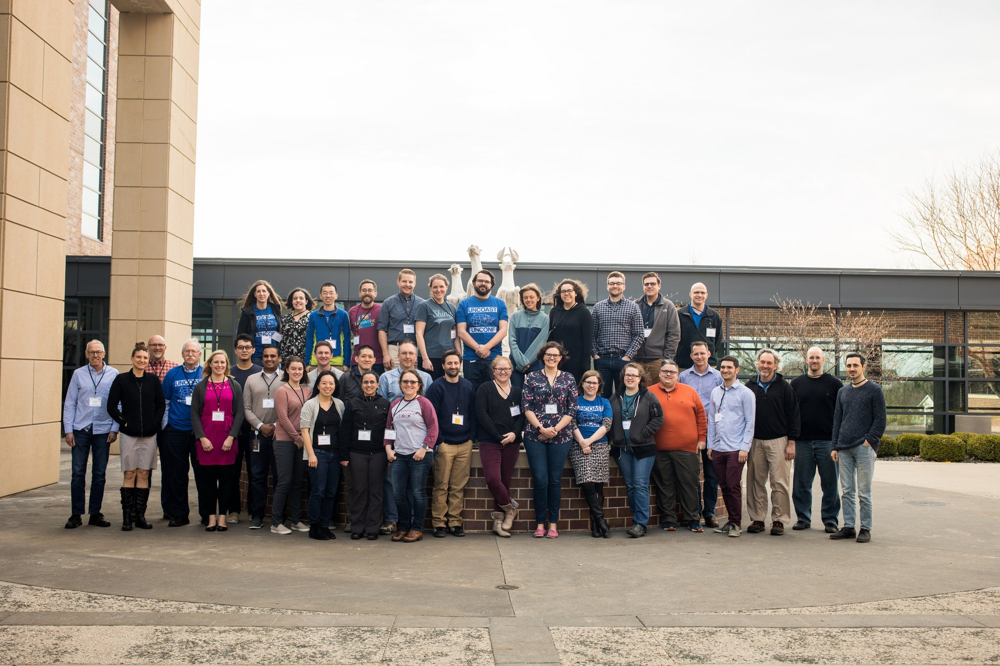
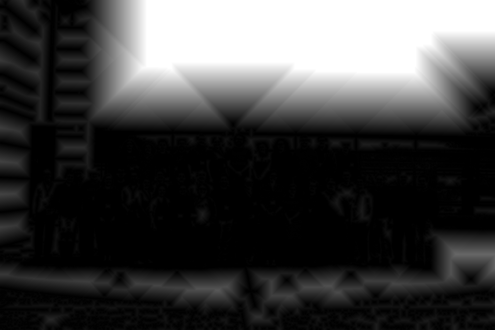
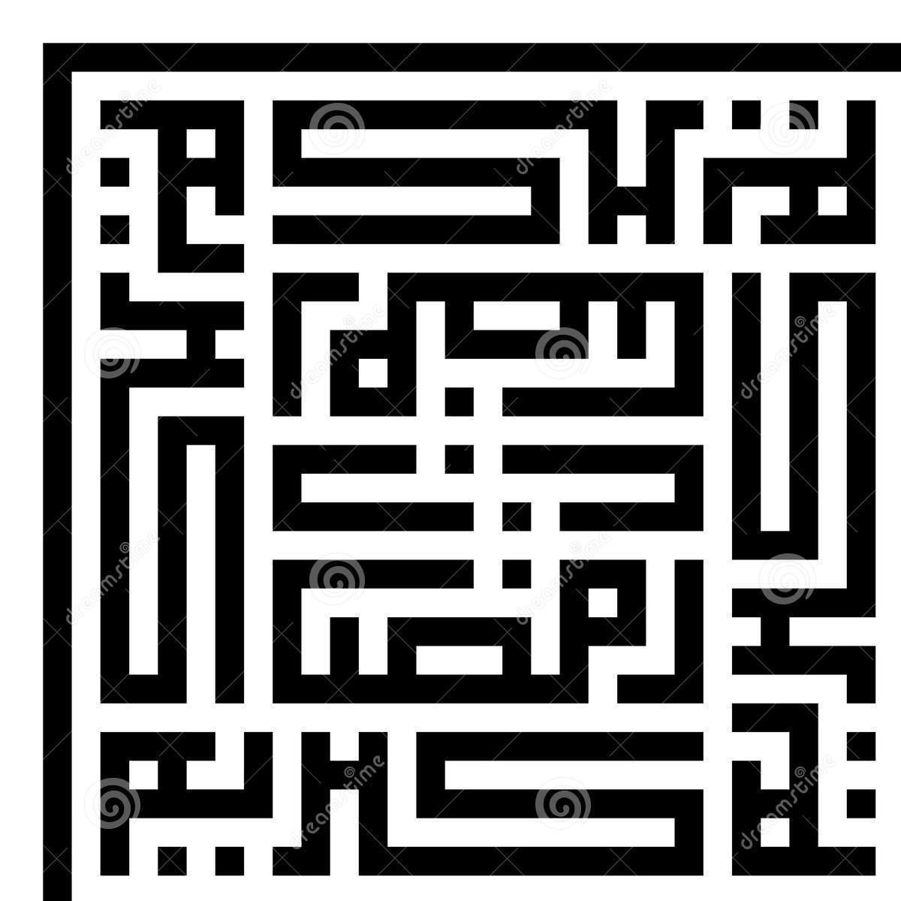
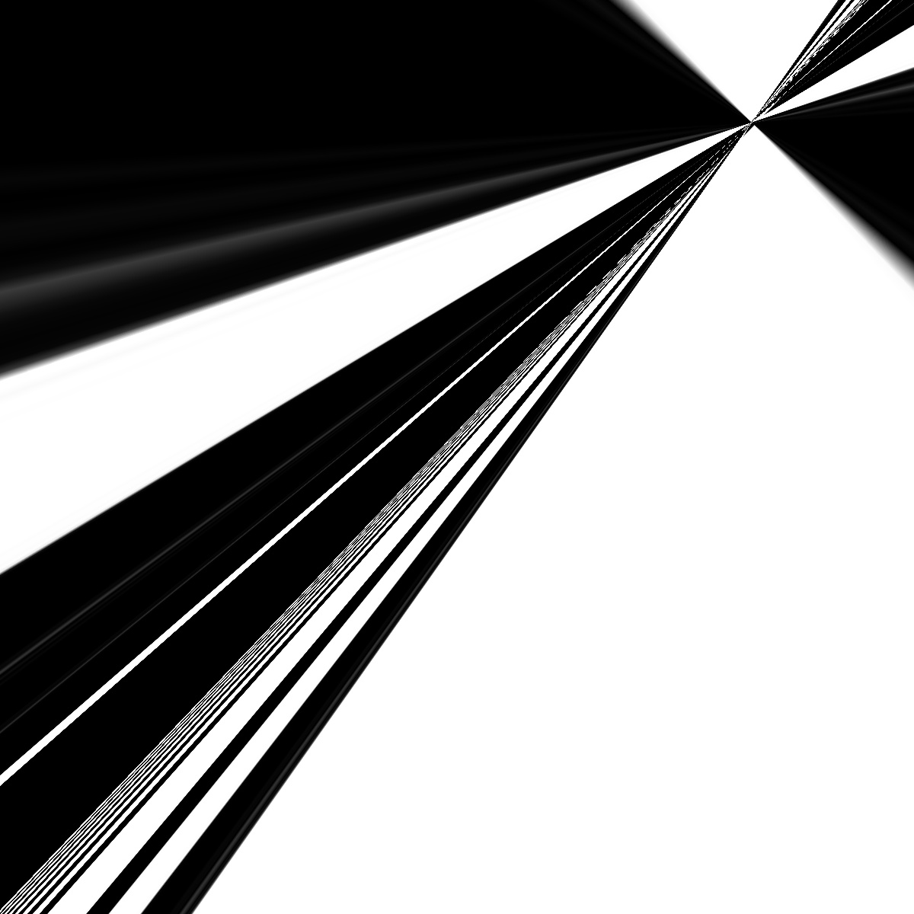

<!-- README.md is generated from README.Rmd. Please edit that file -->

```{r, include = FALSE}
knitr::opts_chunk$set(
  collapse = TRUE,
  comment = "#>",
  fig.path = "man/figures/README-",
  out.width = "100%"
)
```
# opencv

<!-- badges: start -->
<!-- badges: end -->
# Bindings to 'OpenCV' Computer Vision Library

> Experimenting with computer vision and machine learning in R. This 
  package exposes some of the available 'OpenCV' <https://opencv.org/> algorithms,
  such as edge, body or face detection. These can either be applied to analyze 
  static images, or to filter live video footage from a camera device. This is a 
  modification of the existing `opencv` R package on CRAN.


## Installation

This is a modification of the `opencv` R package on CRAN. 
On Windows and MacOS, the package can be installed directoy from CRAN:

```r
install.packages("opencv")
```

This version can be found on github using: 

```r
devtools::install_github('uncoast-unconf/opencv')
```

### Install from source

To install from source on MacOS, you need to install the opencv library from homebrew:

```sh
brew install opencv
```

On Ubuntu or Fedora you need [`libopencv-dev`](https://packages.debian.org/testing/libopencv-dev) or [`opencv-devel`](https://apps.fedoraproject.org/packages/opencv-devel/):

```sh
sudo apt-get install libopencv-dev
```

And then install the R bindings:

```r
devtools::install_github("uncoast-unconf/opencv")
library(opencv)
```

## Basic stuff:


# Distance Transform

A distance transform computes the distance of each pixel from the nearest 0 in a binary image.
Here we have implemented an R wrapper for the OpenCV distance transform function.

Here is a picture of all of use from yesterday:

{ width=50% }

Here is a picture of all of us that has been binarized and then has the distance transform applied:

```{r binarized}
library(opencv)

ocv_write(ocv_output_dist(ocv_read('uncoastunconf-group.jpeg')),'bin.jpg')

```
{ width=50% }

# ORB: Oriented FAST and Rotated BRIEF

[ORB](https://docs.opencv.org/3.0-beta/doc/py_tutorials/py_feature2d/py_orb/py_orb.html) is an algorithm that finds keypoints in a grayscale image and determines an orientation,
These keypoints and orientation can then be matched with another image and the image can be 
transformed to be similar to the other image. Here we have made a wrapper for the ORB function
in the OpenCV library and a function which demonstrates its use.

This function uses ORB to transform the first image into the second. Here we have an image and the rotated version of it. We transform the rotated version back to the original version.

{ width=50% }
{ width=50% }

```{r firstset}
library(opencv)

stuff <- orb_read_and_register('rotsquare.jpg', 'square.jpg', 500)
ocv_write(stuff, "corrected.jpg")

```

{ width=50% }

Way cool. 

Unfortunately, this isn't perfect - adding a little blur makes things go a little wonky. Caveat emptor!

Here's the blurred image:

{ width=50% }

And here's the attempt at registering the crisp image to the blurred one. 

```{r oops}
library(opencv)

stuff <- orb_read_and_register('rotsquare.jpg', 'rotblur.jpg', 500)
ocv_write(stuff, 'oops.jpg')

```
{ width=50% }


### Old stuff:

Face recognition:

```r
unconf <- ocv_read('https://jeroen.github.io/images/unconf18.jpg')
faces <- ocv_face(unconf)
ocv_write(faces, 'faces.jpg')
```

Or get the face location data:

```r
facemask <- ocv_facemask(unconf)
attr(facemask, 'faces')
```

## Live Webcam Examples

Live face detection:

```r
library(opencv)
ocv_video(ocv_face)
```

Edge detection:

```r
library(opencv)
ocv_video(ocv_edges)
```

## Combine with Graphics

Replaces the background with a plot:

```r
library(opencv)
library(ggplot2)

# get webcam size
test <- ocv_picture()
bitmap <- ocv_bitmap(test)
width <- dim(bitmap)[2]
height <- dim(bitmap)[3]

png('bg.png', width = width, height = height)
par(ask=FALSE)
print(ggplot2::qplot(speed, dist, data = cars, geom = c("smooth", "point")))
dev.off()
bg <- ocv_read('bg.png')
unlink('pg.png')
ocv_video(function(input){
  mask <- ocv_mog2(input)
  return(ocv_copyto(input, bg, mask))
})
```

Put your face in the plot:

```r
# Overlay face filter
ocv_video(function(input){
  mask <- ocv_facemask(input)
  ocv_copyto(input, bg, mask)
})
```

## Live Face Survey

Go stand on the left if you're a tidier

```r
library(opencv)

# get webcam size
test <- ocv_picture()
bitmap <- ocv_bitmap(test)
width <- dim(bitmap)[2]
height <- dim(bitmap)[3]

# generates the plot
makeplot <- function(x){
  png('bg.png', width = width, height = height, res = 96)
  on.exit(unlink('bg.png'))
  groups <- seq(0, width, length.out = 4)
  left <- rep("left", sum(x < groups[2]))
  middle <- rep("middle", sum(x >= groups[2] & x < groups[3]))
  right <- rep("right", sum(x >= groups[3]))
  f <- factor(c(left, middle, right), levels = c('left', 'middle', 'right'),
              labels = c("Tidy!", "Whatever Works", "Base!"))
  color = I(c("#F1BB7B", "#FD6467", "#5B1A18"))
  plot(f, ylim = c(0, 5),
       main = "Are you a tidyer or baser?", col = color)
  dev.off()
  ocv_read('bg.png')
}

# overlays faces on the plot
ocv_video(function(input){
  mask <- ocv_facemask(input)
  faces <- attr(mask, 'faces')
  bg <- makeplot(faces$x)
  return(ocv_copyto(input, bg, mask))
})
```
