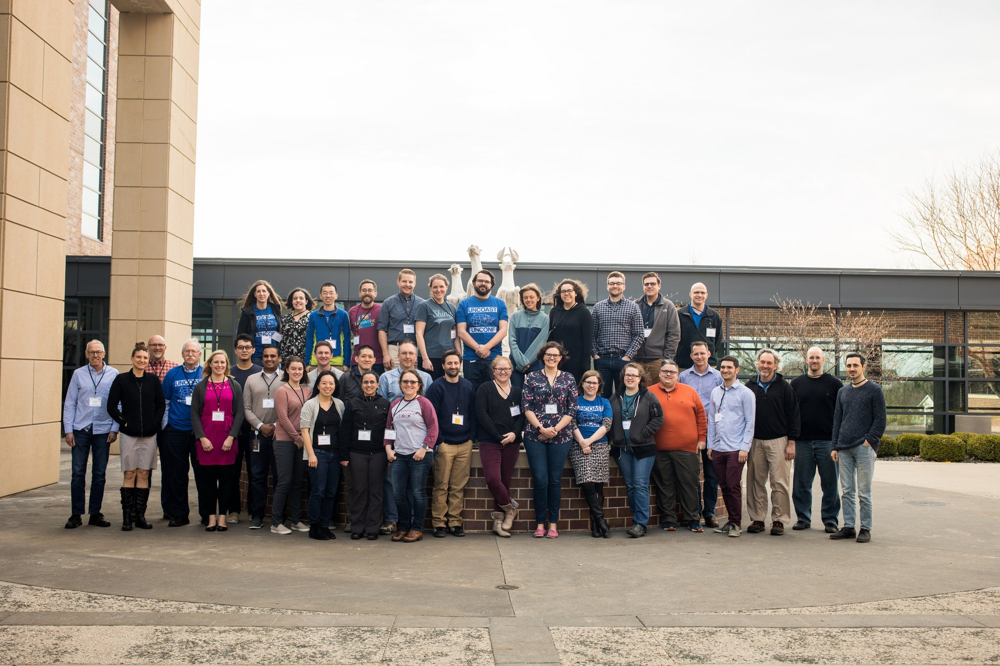
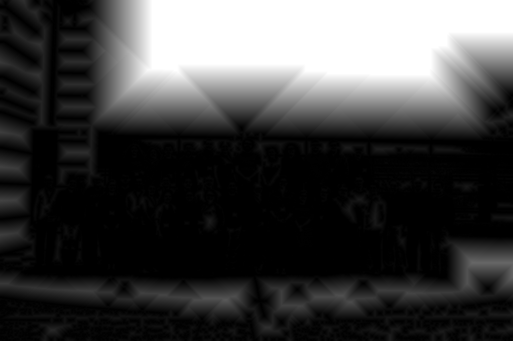
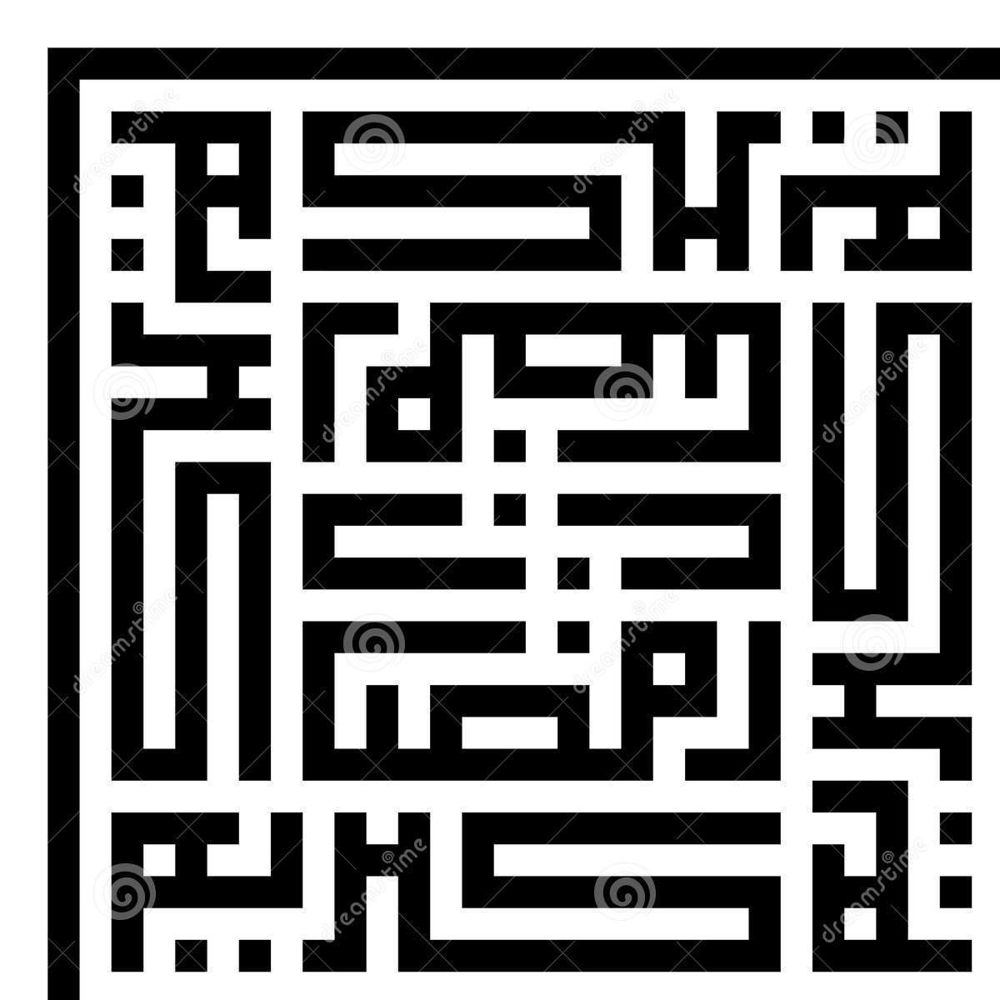
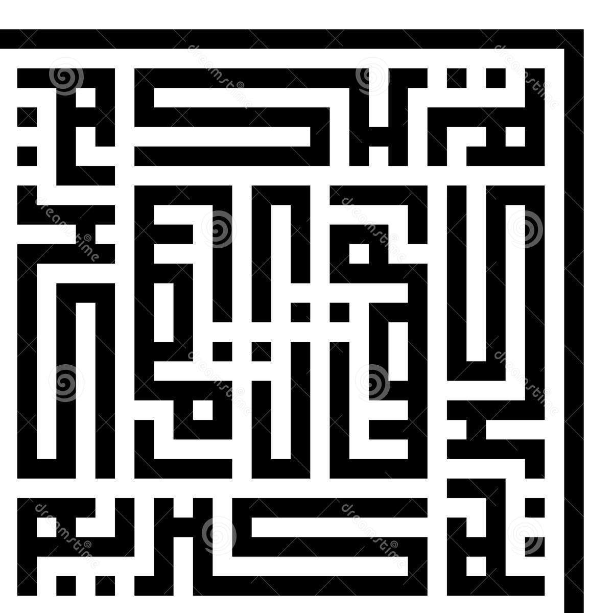
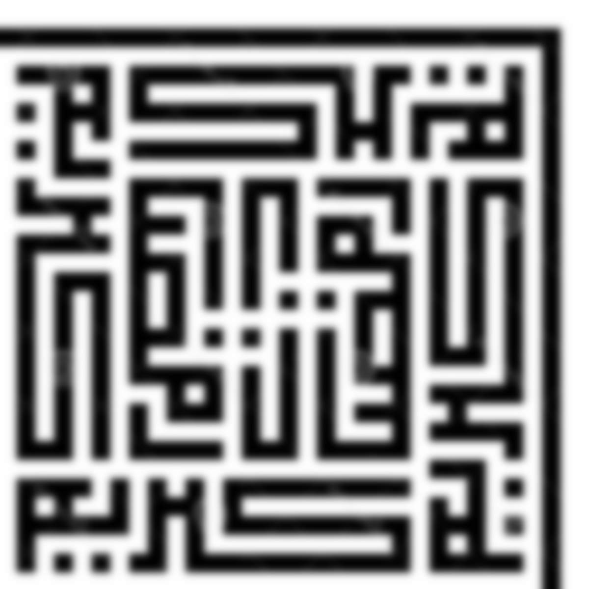
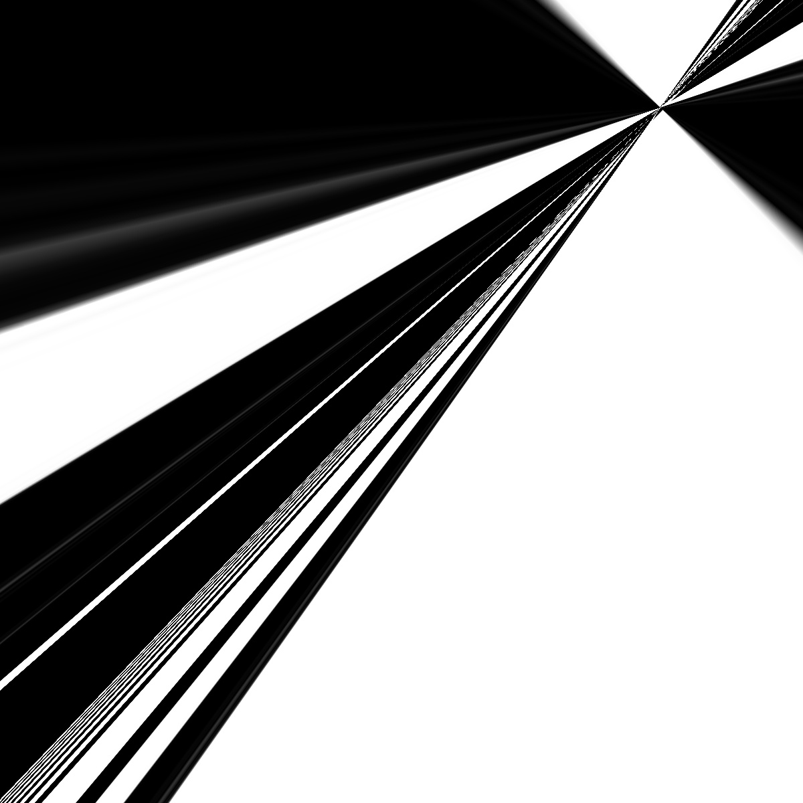

```{r, include = FALSE}
knitr::opts_chunk$set(
  collapse = TRUE,
  comment = "#>"
)
```

```{r setup}
library(opencv)

```

# Distance Transform

A distance transform computes the distance of each pixel from the nearest 0 in a binary image.
Here we have implemented an R wrapper for the OpenCV distance transform function.

Here is a picture of all of use from yesterday:

{ width=50% }

Here is a picture of all of us that has been binarized and then has the distance transform applied:

```{r binarized}
library(opencv)

ocv_write(ocv_output_dist(ocv_read('uncoastunconf-group.jpeg')),'bin.jpg')

```
{ width=50% }

# ORB: Oriented FAST and Rotated BRIEF

[ORB](https://docs.opencv.org/3.0-beta/doc/py_tutorials/py_feature2d/py_orb/py_orb.html) is an algorithm that finds keypoints in a grayscale image and determines an orientation,
These keypoints and orientation can then be matched with another image and the image can be 
transformed to be similar to the other image. Here we have made a wrapper for the ORB function
in the OpenCV library and a function which demonstrates its use.

This function uses ORB to transform the first image into the second. Here we have an image and the rotated version of it. We transform the rotated version back to the original version.

{ width=50% }
{ width=50% }

```{r firstset}
library(opencv)

stuff <- orb_read_and_register('rotsquare.jpg', 'square.jpg')
ocv_write(stuff, "corrected.jpg")

```

{ width=50% }

Way cool. 

Unfortunately, this isn't perfect - adding a little blur makes things go a little wonky. Caveat emptor!

Here's the blurred image:

{ width=50% }

And here's the attempt at registering the crisp image to the blurred one. 

```{r oops}
library(opencv)

stuff <- orb_read_and_register('rotsquare.jpg', 'rotblur.jpg')
ocv_write(stuff, 'oops.jpg')

```
{ width=50% }
